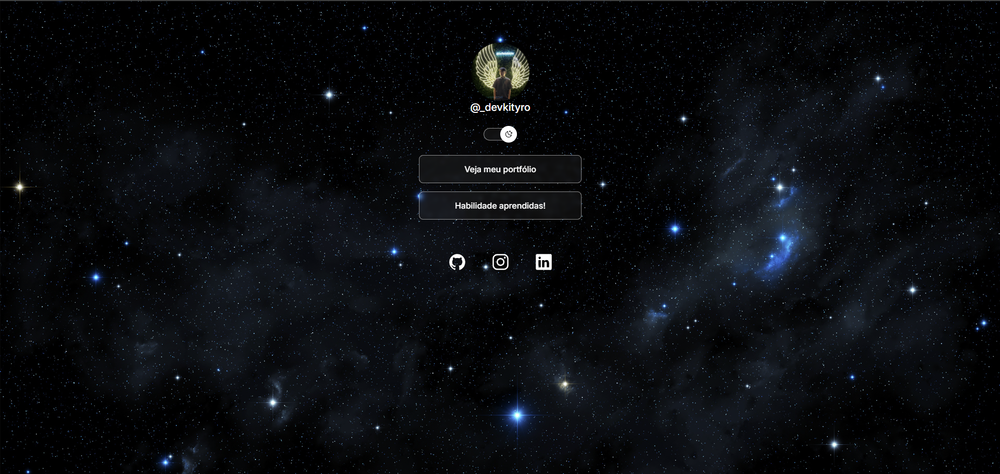

# 🌌 Portfolio — @_devkityro

Página pessoal no estilo "link na bio", com fundo espacial, tema claro/escuro e links para o meu portfólio, minhas habilidades e redes sociais.

## 🛠️ Tecnologias

- HTML5
- CSS3
- JavaScript

## 🌐 Acesse online
link do projeto: https://kityro.github.io/Portfolio2
https://kityro.github.io/Portfolio2/

## 📚 Aprendizados

Projeto desenvolvido durante meus estudos na Rocketseat, praticando HTML, CSS e JavaScript, com foco em layout, temas (claro/escuro) e responsividade.

## 👤 Autor

**Kityro** — [@_devkityro](https://www.instagram.com/_devkityro)

- GitHub: [github.com/Kityro](https://github.com/Kityro)
- Instagram: [@_devkityro](https://www.instagram.com/_devkityro)
- LinkedIn: [Otavio Kityro](https://www.linkedin.com/in/otavio-kityro/)